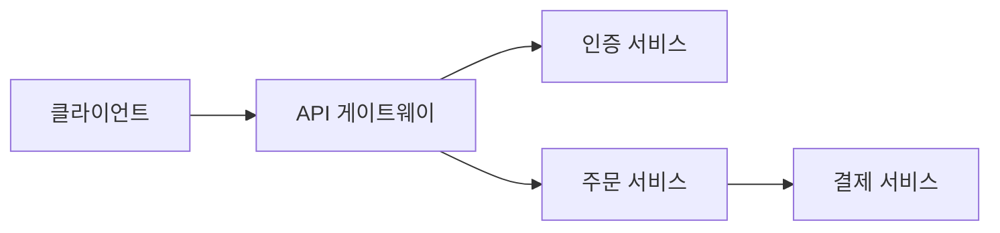

# Claude Code 블로그 포스트 초안 모음

> 이 파일은 content/*.mdx 작성 전 초안을 다듬는 캔버스입니다.
> 각 섹션 = 하나의 MDX 포스트 (order 3~12)

---

# 글 3: project-root-and-init.mdx
## 📁 프로젝트 루트 실행과 /init — Claude Code 첫 설정의 모든 것

Claude Code를 처음 설치하고 나면 "그냥 아무 데서나 실행하면 되지 않나?" 싶을 수 있습니다. 하지만 **어디서 실행하느냐**가 생각보다 훨씬 중요합니다.

---

### 🚀 왜 프로젝트 루트에서 실행해야 할까?

Claude Code는 실행한 디렉토리를 기준으로 파일을 탐색합니다.

```bash
# ❌ 잘못된 예: 엉뚱한 폴더에서 실행
cd ~/Desktop
claude

# ✅ 올바른 예: 프로젝트 루트에서 실행
cd ~/Desktop/my-project
claude
```

엉뚱한 폴더에서 실행하면:
- Claude가 프로젝트 구조를 파악하지 못함
- 파일 경로를 잘못 찾거나 빈 디렉토리만 봄
- `src/components/Button.tsx`를 찾으라고 해도 못 찾음

**프로젝트 루트** = `package.json`, `tsconfig.json`, `.git/` 이 있는 바로 그 폴더입니다.

---

### 🛠️ /init — 프로젝트 설명서 자동 생성

처음 프로젝트에 진입했다면 `/init`을 먼저 실행하세요.

```
/init
```

Claude가 프로젝트를 분석해서 `CLAUDE.md` 파일을 자동으로 만들어 줍니다.

- 폴더 구조 파악
- 주요 설정 파일 분석 (package.json, tsconfig.json 등)
- 빌드·테스트 명령어 감지
- 코드 패턴 파악

---

### 📋 CLAUDE.md란 무엇인가?

`CLAUDE.md`는 **매 대화마다 자동으로 주입되는 프로젝트 기억 장치**입니다.

LLM은 이전 대화를 기억하지 못합니다. 매번 새로운 컨텍스트 윈도우에서 시작하기 때문에, 어제 정했던 코딩 컨벤션이나 폴더 구조를 다음 대화에선 전혀 모릅니다.

`CLAUDE.md`가 이 문제를 해결합니다. 대화가 시작될 때마다 컨텍스트 최상단에 자동으로 주입되어 Claude가 프로젝트 맥락을 매번 다시 인식합니다.

| 상태 | Claude의 행동 |
|------|--------------|
| `CLAUDE.md` **있음** | 프로젝트 컨벤션에 맞는 코드 생성, 올바른 폴더 구조 사용, 팀 규칙 준수 |
| `CLAUDE.md` **없음** | 일반적인 추측에 의존, 매번 같은 설명 반복, 프로젝트 맥락 부재 |

> `CLAUDE.md` = "Claude야, 우리 프로젝트는 이렇게 운영되고 있어"라고 매 대화 시작 시 자동으로 브리핑해주는 문서

CLAUDE.md 작성법은 별도 포스트에서 자세히 다룹니다.

---

### ✅ 시작 체크리스트

새 프로젝트에서 Claude Code를 처음 쓸 때:

1. **프로젝트 루트로 이동** — `cd your-project`
2. **Claude Code 실행** — `claude`
3. **/init 실행** — CLAUDE.md 자동 생성
4. **생성된 CLAUDE.md 검토** — 잘못된 내용은 직접 수정하거나 Claude에게 수정 요청

---

# 글 4: claude-directory-structure.mdx
## 🗂️ .claude/ 디렉토리 완전 정복 — 구조 한눈에 파악하기

Claude Code를 사용하다 보면 `.claude/` 폴더가 자꾸 언급됩니다. 이 폴더 안에 무엇이 있는지, 각각이 무슨 역할인지 한 번에 정리해봅니다.

---

### 📂 전체 디렉토리 구조

```
.claude/                    ← 프로젝트 전용 설정 (Git 커밋 가능)
├── settings.json           ← 권한 설정, Hook 정의
├── commands/               ← 커스텀 슬래시 명령어
│   ├── review.md           →  /review 명령어
│   └── deploy.md           →  /deploy 명령어
├── skills/                 ← 재사용 가능한 작업 매뉴얼
│   └── ppt-generator/
│       └── SKILL.md
└── agents/                 ← 커스텀 Sub-Agent 정의
    └── code-reviewer.md

~/.claude/                  ← 내 모든 프로젝트에 적용되는 개인 설정
├── settings.json           ← 개인 권한·Hook 설정
├── CLAUDE.md               ← 글로벌 개인 지침 (커밋 안 함)
├── commands/               ← 개인 전용 명령어
├── skills/                 ← 개인 전용 스킬
└── agents/                 ← 개인 전용 에이전트
```

---

### 🔍 각 구성 요소 역할

#### `settings.json` — 권한·자동화 설정

Claude가 어떤 도구를 자유롭게 쓸 수 있는지, Hook을 어떻게 동작시킬지 정의합니다.

```json
{
  "permissions": {
    "allow": ["Bash(npm run *)", "Read", "Edit"],
    "deny": ["Bash(rm -rf *)"]
  },
  "hooks": {
    "PostToolUse": [...]
  }
}
```

#### `commands/` — 커스텀 슬래시 명령어

`.md` 파일을 이 폴더에 넣으면 파일 이름이 슬래시 명령어가 됩니다.

```
commands/review.md  →  /review 로 호출
commands/deploy.md  →  /deploy 로 호출
```

탭 자동완성도 지원되고, Claude Code가 구조적으로 인식해서 프롬프트보다 안정적입니다.

#### `skills/` — 재사용 가능한 작업 매뉴얼

반복 작업을 `SKILL.md` 파일로 정의해두면 이름으로 호출하거나 자연어로 트리거할 수 있습니다. (상세 내용은 Skills 포스트에서)

#### `agents/` — 커스텀 Sub-Agent

역할이 특화된 Claude 인스턴스를 미리 정의해둡니다. 코드 리뷰 전용, 문서 작성 전용 등. (상세 내용은 Sub-Agent 포스트에서)

---

### 📍 프로젝트 vs 개인 설정 분리

| 위치 | 범위 | Git 커밋 | 언제 사용? |
|------|------|----------|-----------|
| `.claude/` | 이 프로젝트에서만 | ✅ 팀 공유 가능 | 팀 공통 명령어, 프로젝트 전용 스킬 |
| `~/.claude/` | 내 모든 프로젝트 | ❌ 개인 전용 | API 키, 개인 스타일, 나만 쓰는 에이전트 |

> 💡 팀 공통 규칙은 `.claude/`에, 개인 설정은 `~/.claude/`에 — 이 구분을 지키면 팀 협업이 깔끔해집니다.

---

### 🎯 우선순위

같은 이름의 설정이 여러 곳에 있으면? **Enterprise > Personal > Project** 순서로 적용됩니다.

```
Enterprise 관리자 설정
    ↓ (덮어씌움)
~/.claude/ 개인 설정
    ↓ (덮어씌움)
.claude/ 프로젝트 설정
```

---

# 글 5: claude-md-guide.mdx
## 📋 CLAUDE.md 완전 정복 — Claude에게 완벽한 프로젝트 브리핑하기

`CLAUDE.md`는 Claude Code의 핵심입니다. 잘 작성된 CLAUDE.md 하나가 수십 번의 반복 설명을 대신합니다. 이 글에서는 효과적인 CLAUDE.md를 작성하는 모든 방법을 정리합니다.

---

### ✍️ 뭘 넣어야 할까? — 5가지 핵심 항목

```markdown
# CLAUDE.md

## ⚠️ 절대 규칙 (맨 위에 배치!)
- 프로덕션 DB 직접 쿼리 금지
- .env 파일 커밋 금지
- 패키지 매니저는 npm만 사용

## 🏗️ 아키텍처
(폴더 구조를 트리 형태로 — Claude가 파일을 바로 찾을 수 있게)
src/
├── app/          # Next.js App Router 페이지
├── components/   # 재사용 UI 컴포넌트
└── lib/          # 유틸리티, API 클라이언트

## 🔧 빌드 & 테스트 명령어
- 개발 서버: npm run dev
- 빌드: npm run build
- 테스트: npm run test

## 💼 도메인 컨텍스트
(비즈니스 로직 설명 — "Product → Variant → 독립 재고" 같은 핵심 개념)

## 📏 코딩 컨벤션
- 컴포넌트: PascalCase
- 훅: camelCase (use 접두사)
- 커밋 메시지: feat. 한글 설명 형식
```

**우선순위 팁**: 절대 규칙은 반드시 맨 위에 배치하세요. Claude는 컨텍스트 앞부분에 나온 내용을 더 강하게 인식합니다.

---

### 🎯 트리거 키워드 등록

자주 쓰는 워크플로우를 키워드로 등록해두면 한 마디로 실행할 수 있습니다.

```markdown
## 트리거 키워드
- "build the app" → npm run build 실행 후 결과 리포트
- "deploy staging" → Vercel staging 환경에 배포
- "run tests" → npm test 실행 후 실패한 테스트 분석
```

이제 "build the app"이라고 말하면 Claude가 자동으로 빌드를 실행하고 결과를 알려줍니다.

---

### 🤝 팀 공유 vs 개인 설정 분리

| 파일 위치 | 내용 | Git 커밋 |
|----------|------|----------|
| 프로젝트 `CLAUDE.md` | 팀 공통 규칙, 아키텍처 | ✅ 커밋 → 팀 전체 공유 |
| `~/.claude/CLAUDE.md` | 개인 API 키, 개인 선호도 | ❌ 커밋 안 함 |

---

### 📦 Lazy Loading — 토큰 절약의 핵심

CLAUDE.md에 모든 걸 직접 써 넣으면 매 세션마다 수천 토큰이 낭비됩니다. **참조만 두고 상세 내용은 별도 파일로** 분리하세요.

```markdown
# ❌ 나쁜 예 — 모든 내용을 CLAUDE.md에 직접 작성
## API 엔드포인트
- POST /api/auth/login — 로그인
- POST /api/auth/register — 회원가입
- GET /api/users/:id — 유저 조회
- ... (50개 더)
```

```markdown
# ✅ 좋은 예 — 한 줄짜리 참조만 남기기
## 프로젝트 문서
- API 스펙: @docs/api-spec.md
- DB 스키마: @docs/db-schema.md
- 인증 설계: @docs/auth.md
- 코딩 컨벤션: @docs/conventions.md
```

Claude는 필요할 때만 `@` 참조된 파일을 읽습니다. 이게 **Lazy Loading**입니다. 평소에는 가볍고, 필요할 때만 전체를 불러옵니다.

> 💡 CLAUDE.md는 되도록 **300자 이내**로 유지하는 게 효율적입니다.

---

### 📁 폴더별 CLAUDE.md

대규모 프로젝트에서는 폴더별로 CLAUDE.md를 분리할 수 있습니다.

```
src/
├── auth/
│   └── CLAUDE.md     # 인증 모듈 전용 규칙
├── payments/
│   └── CLAUDE.md     # 결제 모듈 전용 규칙
└── CLAUDE.md         # 전체 공통 규칙
```

Claude가 `src/auth/` 폴더 작업을 할 때만 `src/auth/CLAUDE.md`를 읽습니다. 컨텍스트 낭비 없이 정확한 규칙만 주입됩니다.

---

### 🗺️ Mermaid 아키텍처 다이어그램

텍스트 설명보다 다이어그램이 훨씬 빠릅니다. CLAUDE.md에 Mermaid로 아키텍처를 넣어보세요.

```markdown
## 시스템 구조



```

> 💡 별도 파일(`docs/architecture.md`)에 정리하고, CLAUDE.md에서 `@docs/architecture.md`로 참조하면 더 깔끔합니다.

---

### 🔄 Claude에게 CLAUDE.md 업데이트 맡기기

직접 수정하지 않아도 됩니다. Claude에게 이렇게 요청하면 됩니다.

```
"방금 우리가 정한 패턴, CLAUDE.md에 추가해줘"
"오늘 결정한 DB 스키마 변경 내용 문서화해줘"
```

Claude가 기존 내용과 자연스럽게 병합해서 업데이트해줍니다.

---

# 글 6: permissions-settings.mdx
## 🔐 권한 설정 (settings.json) — Claude에게 무엇을 허용할까?

Claude Code는 파일 읽기, 코드 실행, 터미널 명령 등 강력한 도구를 가지고 있습니다. `settings.json`으로 어떤 도구를 자유롭게 쓸 수 있고, 어떤 건 확인을 받아야 하는지 세밀하게 제어할 수 있습니다.

---

### 📍 settings.json 위치

```
~/.claude/settings.json     ← 개인 전용 (모든 프로젝트 적용)
.claude/settings.json       ← 프로젝트 전용 (팀 공유 가능)
```

---

### 🛡️ permissions — 도구 허용/차단

```json
{
  "permissions": {
    "allow": [
      "Bash(npm run *)",
      "Bash(git *)",
      "Read",
      "Edit",
      "Write"
    ],
    "deny": [
      "Bash(rm -rf *)",
      "Bash(sudo *)"
    ]
  }
}
```

| 설정 | 동작 |
|------|------|
| `allow` 목록에 있음 | 확인 없이 자동 실행 |
| `deny` 목록에 있음 | 무조건 차단 |
| 둘 다 아님 | 실행 전 사용자에게 확인 요청 |

**패턴 문법**: `Bash(npm run *)` — `npm run`으로 시작하는 모든 bash 명령 허용

---

### ⚡ allowedTools — 자주 쓰는 도구 한번에 허용

```json
{
  "allowedTools": ["Read", "Edit", "Write", "Glob", "Grep", "Bash"]
}
```

개발 중에는 `Read`, `Edit`, `Write`는 거의 항상 쓰이므로 허용해두면 편합니다.

---

### 🔧 실전 권장 설정

```json
{
  "permissions": {
    "allow": [
      "Read",
      "Edit", 
      "Write",
      "Glob",
      "Grep",
      "Bash(npm *)",
      "Bash(git status)",
      "Bash(git diff *)",
      "Bash(git log *)",
      "Bash(git add *)",
      "Bash(git commit *)"
    ],
    "deny": [
      "Bash(git push --force *)",
      "Bash(rm -rf *)",
      "Bash(sudo *)",
      "Bash(curl * | bash)"
    ]
  }
}
```

---

### 🪝 Hooks 설정도 여기에

`settings.json`은 Hook(자동화 트리거)도 정의하는 파일입니다. 권한 설정과 Hook이 한 파일에 함께 들어갑니다.

```json
{
  "permissions": { ... },
  "hooks": {
    "PostToolUse": [
      {
        "matcher": "Edit",
        "hooks": [
          {
            "type": "command",
            "command": "npm run lint --silent"
          }
        ]
      }
    ]
  }
}
```

Hook에 대한 자세한 내용은 Hooks & 자동화 포스트에서 다룹니다.

---

### 💡 Sub-Agent & Hook 사용 시 필수 주의사항

Sub-Agent나 Hook이 Bash 명령을 실행하게 하려면, 해당 명령이 `allow` 목록에 있어야 합니다. 설정 없이 쓰면 매번 확인 팝업이 떠서 자동화가 끊깁니다.

---

# 글 7: context-and-token.mdx
## 🧠 컨텍스트 & 토큰 관리 — Claude를 항상 신선하게 유지하기

Claude Code는 200K 토큰의 컨텍스트 윈도우를 가지고 있습니다. 이걸 어떻게 관리하느냐에 따라 Claude의 응답 품질과 비용이 크게 달라집니다.

---

### 📊 컨텍스트 사용량 확인

```
/context
```

바(bar) 형태로 현재 토큰 사용량을 보여줍니다. **80% 이상이면** 정리가 필요합니다.

| 사용량 | 조치 |
|--------|------|
| ~60% | 계속 진행 |
| 80%+ | `/compact`로 압축 |
| 90%+ | `/clear`로 초기화 후 새 작업 시작 |

---

### 🧹 /clear vs /compact — 언제 무엇을?

```
/clear    → 컨텍스트 완전 초기화 (새 작업 시작)
/compact  → 대화 내용 압축 (맥락은 유지, 토큰만 절약)
```

| 명령어 | 컨텍스트 | 언제 |
|--------|----------|------|
| `/clear` | 완전 삭제 | 전혀 다른 새 작업 시작할 때 |
| `/compact` | 요약본 유지 | 같은 작업 계속하되 토큰 정리할 때 |

---

### 🧠 Second Brain 구축 — /memory 활용

Claude와 작업하면서 배운 것들을 로컬 마크다운 파일에 저장하면, 다음 세션에서 자동으로 불러옵니다.

```markdown
## 2024-01-15: 인증 방식 변경
- JWT에서 세션 기반으로 변경
- 이유: 모바일 앱에서 토큰 리프레시 이슈
- 참고: auth/session.ts
```

**저장 위치**: `~/.claude/projects/<project>/memory/MEMORY.md`
- 매 세션 시작 시 처음 200줄 자동 로드
- "기억해줘"라고 말하면 저장됨
- `/memory` 명령으로 확인·편집 가능

| 메모리 종류 | 저장 위치 | 용도 |
|------------|-----------|------|
| 개인 메모리 | `/memory` | 나만 아는 맥락, 개인 노트 |
| 팀 공유 지식 | `CLAUDE.md` | 팀 전체가 알아야 할 규칙 |

---

### ⚡ 핵심 원칙: 한 세션 = 한 피처

하나의 세션에서 여러 기능을 연달아 구현하지 마세요. **신선한 컨텍스트가 부풀어진 컨텍스트보다 항상 낫습니다.**

**실전 워크플로우:**
```
1. Plan Mode에서 전체 작업을 설계하고 단계를 나눈다
2. /clear 또는 새 세션을 연다
3. 플랜의 첫 번째 단계만 구현한다
4. 완료되면 다시 /clear → 다음 단계로
```

---

### 🔌 MCP 토큰 모니터링

MCP(외부 도구)를 여러 개 연결하면 **도구 설명만으로도 토큰을 크게 소비**합니다.

```
/mcp
```

- 안 쓰는 MCP는 비활성화하세요
- Notion, Linear 같은 MCP는 도구 설명이 특히 큽니다
- 자주 쓰는 기능만 골라 **커스텀 MCP를 래핑**하면 토큰 절약 + 응답 품질 향상

---

### 📤 무거운 작업은 스크립트로 오프로드

무거운 데이터 처리를 대화 안에서 시키면 **컨텍스트가 오염**됩니다. Claude에게 스크립트를 작성하게 하고 결과 요약만 받으세요.

| 상황 | 프롬프트 예시 |
|------|-------------|
| DB 마이그레이션 검증 | "10만 행 CSV 파싱해서 무결성 검증 스크립트 작성해줘. 결과는 summary.json으로" |
| 로그 분석 | "수백 MB 로그에서 에러 패턴 추출 스크립트 만들어줘. report.md로 정리" |
| API 응답 비교 | "v1과 v2 응답 차이 비교 스크립트 작성해줘. diff를 api-diff.json으로" |

**핵심**: 무거운 데이터는 스크립트로, **결과 요약만** Claude에게 전달.

---

# 글 8: shortcuts-and-commands.mdx
## ⌨️ 단축키 & 슬래시 명령어 심화 — 속도 10배 올리는 Claude Code 조작법

Claude Code를 쓰다 보면 "이거 더 빠르게 할 수 있지 않을까?" 싶을 때가 있습니다. 단축키와 슬래시 명령어를 제대로 알면 작업 속도가 눈에 띄게 달라집니다.

---

### ⌨️ 핵심 단축키

#### `Shift + Tab` — Plan Mode ↔ Accept Mode 전환

Claude Code의 가장 중요한 단축키입니다.

| 모드 | 동작 |
|------|------|
| **Plan Mode** | Claude가 계획만 세우고 실행은 안 함 |
| **Accept Mode** | Claude가 계획 + 실행까지 함 |

> 💡 새로운 작업은 항상 **Plan Mode**로 시작하세요. 계획을 확인한 후 Accept Mode로 전환하면 엉뚱한 수정을 예방할 수 있습니다.

**Plan Mode가 토큰 절약에 좋은 이유:**
- 방향이 틀렸을 때 코드 생성 전에 잡을 수 있음
- 잘못된 방향으로 2~3번만 반복해도 토큰이 3배 이상 낭비됨
- 짧은 텍스트 계획 단계에서 컨텍스트 윈도우를 온전히 보존

#### `Escape` — 상황별 3가지 동작

| 누르는 횟수 | 상황 | 동작 |
|------------|------|------|
| 1번 | 생성 중 | 즉시 중단 |
| 2번 | 입력창에 텍스트 있음 | 입력 삭제 |
| 2번 | 입력창이 비어 있음 | 이전 입력 복원 |

> 실수로 긴 프롬프트를 날렸을 때 Escape 2번으로 되살릴 수 있습니다.

---

### ⚡ `!` 접두사 — 대화 중 bash 명령 실행

Claude 프롬프트에서 `!`를 붙이면 대화를 끊지 않고 터미널 명령을 바로 실행합니다.

```bash
!npm run build
!git status
!ls -la src/
```

---

### 🧹 컨텍스트 관리 명령어

| 명령어 | 역할 |
|--------|------|
| `/clear` | 컨텍스트 완전 초기화 |
| `/compact` | 대화 내용 압축 (맥락 유지) |
| `/context` | 토큰 사용량 확인 (바 형태) |

---

### 🤖 모델 & 세션 명령어

| 명령어 | 역할 |
|--------|------|
| `/models` | 모델 전환 (Opus/Sonnet/Haiku) |
| `/resume` | 이전 세션 복구 |
| `/export` | 채팅 내보내기 (다른 AI에게 공유 시) |
| `/output-style` | 응답 스타일 설정 (학습 모드, 간결 모드 등) |
| `/mcp` | MCP 연결 관리 (안 쓰는 건 비활성화) |

**모델 선택 가이드:**
- **Opus** — 가장 똑똑함. 복잡한 아키텍처, 어려운 버그
- **Sonnet** — 균형잡힌 성능. 일반적인 코딩 작업
- **Haiku** — 가장 빠름. 간단한 질문, 파일 탐색

---

### 🛠️ 커스텀 슬래시 명령어 만들기

`.claude/commands/` 폴더에 `.md` 파일을 넣으면 바로 슬래시 명령어가 됩니다.

```
.claude/
  commands/
    review.md         →  /review
    deploy-staging.md →  /deploy-staging
    create-pr.md      →  /create-pr
```

**명령어 파일 예시** (`commands/review.md`):

```markdown
코드 리뷰를 수행합니다.

1. git diff HEAD로 최근 변경사항 확인
2. 변경된 파일들의 코드 품질 검토
3. 버그, 타입 오류, 성능 이슈 체크
4. 개선 사항을 우선순위별로 리포트
```

이제 `/review`라고 입력하면 탭 자동완성도 되고, Claude가 구조적으로 이 명령을 인식합니다.

> 💡 CLAUDE.md의 트리거 키워드와 비슷하지만, 슬래시 명령어는 **탭 자동완성**이 되고 더 안정적입니다.

---

# 글 9: workflow-and-philosophy.mdx
## 🔄 효율적인 코딩 워크플로우 — Claude와 함께 일하는 방법

도구를 잘 쓰는 것보다 중요한 건 **어떻게 일하느냐**입니다. Claude와 함께 할 때 생산성을 극대화하는 워크플로우와 철학을 정리했습니다.

---

### 📋 1. Plan Mode 먼저

큰 변경 작업은 **반드시 Plan Mode**(`Shift+Tab`)로 시작하세요.

```
1. Plan Mode에서 Claude에게 작업 설명
2. Claude가 계획 제시 — 어떤 파일을 수정할지, 어떤 접근을 할지
3. 계획을 리뷰하고 피드백
4. 만족하면 Accept Mode로 전환하여 실행
```

> ⚠️ Plan 없이 바로 실행하면, Claude가 엉뚱한 방향으로 코드를 대량 수정하는 참사가 벌어질 수 있습니다.

---

### 🔁 2. TDD 기반 스마트 코딩 루프

```
기능 하나 추가 → 테스트 → 린트 → 커밋 → 반복
```

작은 단위로 쪼개서 반복하면:
- 문제가 생겨도 **마지막 커밋**으로 돌아가면 됨
- 디버깅 범위가 명확해짐
- Claude가 각 단계에서 검증할 수 있음

---

### 🧐 3. Thinking 로그 읽기 + Escape로 즉시 중단

Claude가 생각하는 과정(thinking 로그)을 무시하지 마세요.

> 🛑 Claude가 잘못된 가정을 하고 있다면, 그 순간 **Escape**로 중단하세요. 잘못된 가정 위에 쌓인 코드는 전부 쓸모없습니다. **초반에 잡는 게 핵심**입니다.

---

### 🔀 4. 다른 AI에게 비평 받기

Claude와 작업하다가 막히면, `/export`로 대화를 내보내서 ChatGPT나 Gemini에게 보여주세요.

```
"이 대화를 분석해서, Claude가 놓치고 있는 것이나 잘못된 접근이 있으면 지적해줘"
```

> 💡 자동화 팁: 커스텀 슬래시 명령어로 `/review-with-gpt` 같은 명령을 만들면 이 과정을 원커맨드로 처리할 수 있습니다.

---

### 🐛 5. 에러 로그 그대로 붙여넣기

> ⚠️ 에러를 해석해서 설명하지 마세요. **에러 로그를 통째로** Claude에게 던지세요.

여러분이 해석하면 오히려 정보가 빠집니다. Claude는 스택 트레이스 분석에 능합니다.

```
# ❌ "빌드할 때 타입 오류가 나는 것 같아"
# ✅ (에러 로그 전체 붙여넣기)
TypeError: Cannot read properties of undefined (reading 'map')
    at PostList (/src/components/PostList.tsx:23:14)
    ...
```

---

### ✅ 6. TODO.md로 작업 연속성 유지

프로젝트 루트에 `TODO.md`를 만들어 Claude에게 태스크를 추적하게 하세요.

```markdown
- [ ] 결제 기능 구현 (Stripe 연동)
- [x] 랜딩 페이지 CTA 수정
- [ ] 버그 #1: 로그인 리다이렉트 오류
- [ ] 버그 #2: 모바일 레이아웃 깨짐
```

**실전 워크플로우:**
1. 하루 시작 — 할 일을 `TODO.md`에 체크리스트로 작성
2. Claude에게 **"TODO.md 읽고 첫 번째 항목부터 시작해"** 지시
3. 세션 종료 시 **"TODO.md 업데이트해줘"** → 진행 상황 자동 반영

여러 세션에 걸쳐 작업의 연속성을 유지하는 핵심 도구입니다.

---

### 🏛️ 7. WAT 프레임워크 — 복잡한 프로젝트 관리법

Nate Herk가 제안한 방법론으로, 복잡한 AI 협업 프로젝트를 체계적으로 관리합니다.

| 구성 요소 | 의미 | 핵심 |
|----------|------|------|
| **W**orkflows | 작업 흐름 정의 | plain English로 단계를 명확히 정의 |
| **A**gents | AI 에이전트 활용 | Self-healing + Sub-agent 병렬 처리 |
| **T**ools | 도구 조합 | 작고 원자적인 도구들을 조합 |

#### W — Workflows: 10분 투자로 수시간의 삽질을 줄인다

코드를 쓰기 전에 **작업 흐름을 글로 먼저** 정의하세요.

```
1. DB 스키마에 due_date, notification_sent 컬럼 추가
2. 마감일 설정 UI 컴포넌트 구현
3. 크론잡으로 마감 24시간 전 알림 발송 로직 작성
4. 알림 발송 후 notification_sent 플래그 업데이트
5. 각 단계마다 테스트 작성 후 통과 확인
```

#### A — Agents: Self-Healing + 병렬 처리

Claude Code는 에러가 나면 스스로 로그를 읽고, 원인을 파악하고, 코드를 수정하고, 다시 실행합니다.

Sub-Agent로 역할을 분리하면 동시에 여러 작업을 처리할 수 있습니다:
- Sub-Agent A → 테스트 작성 및 실행
- Sub-Agent B → 관련 문서 업데이트
- Sub-Agent C → 코드 린트 및 타입 체크

하나의 Claude가 순차적으로 10분 걸릴 작업을 3개의 Sub-Agent가 동시에 돌리면 **3~4분**에 끝납니다.

#### T — Tools: 작은 도구가 큰 도구를 이긴다

```bash
# ❌ 나쁜 예: deploy-all.sh (200줄짜리 거대 스크립트)

# ✅ 좋은 예: 원자적 도구들의 조합
scripts/build.sh        # 빌드만
scripts/test.sh         # 테스트만
scripts/migrate.sh      # DB 마이그레이션만
scripts/deploy.sh       # 배포만
```

작은 단위의 스크립트는 조합하기 쉽고, 어느 단계에서 실패했는지 명확합니다.

---

# 글 10: skills-guide.mdx
## 🎯 Skills — 재사용 가능한 업무 매뉴얼

"같은 프롬프트를 매번 입력하고 있다면?" Skills를 만들 때입니다. 한 번 정의해두면 이름만 불러도 항상 같은 품질의 결과를 얻을 수 있습니다.

---

### 🤔 프롬프트 vs Skills — 뭐가 다른가?

| 비교 항목 | 프롬프트 | Skills |
|----------|---------|--------|
| 입력 방식 | 매번 직접 타이핑 | `/skill-name` 또는 자연어 트리거 |
| 결과 품질 | 들쭉날쭉 | 항상 동일한 기준 |
| 팀 공유 | 어려움 | Git에 올리면 즉시 공유 |
| 토큰 비용 | 매번 전체 로드 | 평소엔 설명만 (~50-100B) |

> 프롬프트가 "한 번의 지시"라면, Skills는 **"재사용 가능한 업무 시스템"**입니다.

---

### 📂 스킬 디렉토리 구조

```
.claude/skills/
└── ppt-generator/            ← 스킬 폴더 이름 = 스킬 이름
    ├── SKILL.md               ← 핵심 파일 (필수)
    ├── template.md            ← 템플릿 (선택)
    ├── examples/              ← 예제 (선택)
    └── scripts/               ← 스크립트 (선택)
```

---

### ⚡ 2단계 로딩 방식 — 토큰 절약의 비밀

Skills의 핵심은 **평소엔 가볍고, 쓸 때만 전체를 불러오는** 구조입니다.

```
1단계: 항상 로드 — 스킬 이름 + description (~50-100 바이트)
2단계: 호출 시에만 — SKILL.md 본문 + 참고 파일 전체
```

| 비교 항목 | CLAUDE.md | Skills | MCP 도구 | Sub-Agent |
|----------|-----------|--------|----------|-----------|
| 평소 공간 | 전체 매번 | 설명만 (~50B) | 전체 설명 매번 | 에이전트 설명 매번 |
| 안 쓸 때 부담 | 항상 있음 | **거의 없음** | 항상 있음 | 항상 있음 |
| 언제 좋은가 | 핵심 규칙 | 반복 작업 | 외부 API 연동 | 대량 탐색/분석 |

---

### ✍️ SKILL.md 작성법

```yaml
---
name: ppt-generator
description: "PPT 발표자료 자동 생성. 'PPT 만들어줘',
  '발표자료 작성', '슬라이드 제작' 요청 시 트리거."
---

## 목적
주제와 핵심 내용을 입력하면 PPT 발표자료를 자동 생성합니다.

## 절차
1. 발표 주제, 대상 청중, 발표 시간 확인
2. 목차 및 슬라이드 구성 설계
3. 각 슬라이드별 내용 작성
4. .pptx 파일로 출력

## 자체 검증 체크리스트
- [ ] 슬라이드 수가 적절한가?
- [ ] 핵심 메시지가 있는가?
- [ ] 시각 자료 지시사항이 포함되었는가?
```

**description 작성 팁:**
- ✅ 좋은 예: "PPT 발표자료 자동 생성. 'PPT 만들어줘', '발표자료 작성' 요청 시 트리거."
- ❌ 나쁜 예: "문서를 생성하는 스킬" (너무 추상적)

핵심 기능이 첫 문장에, 사용자가 쓸 법한 표현 3개 이상 포함하는 것이 좋습니다.

---

### 📍 스킬 저장 위치 & 범위

| 위치 | 경로 | 적용 대상 |
|------|------|----------|
| **Enterprise** | 관리 설정 | 조직의 모든 사용자 |
| **Personal** | `~/.claude/skills/<name>/SKILL.md` | 내 모든 프로젝트 |
| **Project** | `.claude/skills/<name>/SKILL.md` | 이 프로젝트만 (Git 공유 가능) |
| **Plugin** | `<plugin>/skills/<name>/SKILL.md` | 플러그인 활성화된 곳 |

> 💡 우선순위: Enterprise > Personal > Project. 팀 공유: `.claude/skills/`를 Git에 커밋하면 팀원이 pull 받는 순간 바로 사용 가능합니다.

---

### 🛠️ 스킬 만들기

**방법 1 — 수동 생성:**
```bash
mkdir -p .claude/skills/ppt-generator
# SKILL.md 작성
```

**방법 2 — skill-creator 플러그인 (추천):**
```
/install-plugin skill-creator
```
설치 후 "스킬 만들어줘"라고 말하면 자동 트리거됩니다. description 최적화, frontmatter 설정, 지원 파일 구성까지 모범 사례를 자동으로 적용해줍니다.

---

# 글 11: sub-agent-parallel.mdx
## 🤖 Sub-Agent & 병렬 처리 — Claude를 여러 명처럼 쓰는 법

시간이 오래 걸리는 작업, 서로 독립적인 여러 작업... Sub-Agent를 쓰면 이런 상황에서 극적인 효율 향상을 경험할 수 있습니다.

---

### 🤔 Sub-Agent란?

메인 Claude 안에서 **별도의 작업 공간을 가진 도우미**를 하나 더 띄우는 것입니다.

각 Sub-Agent는:
- 자기만의 지시사항, 도구, 권한을 가짐
- 조사 결과는 Sub-Agent 쪽에만 남음
- 메인에는 **요약만** 돌아옴

---

### ⚡ 핵심 장점 4가지

| 장점 | 설명 |
|------|------|
| **병렬 처리** | 여러 작업을 동시에 실행해 전체 소요 시간 단축 |
| **컨텍스트 보호** | 메인 에이전트의 컨텍스트를 오염시키지 않음 |
| **전문화** | 각 Sub-Agent에 전문 역할 부여 가능 |
| **재사용** | 한 번 만든 에이전트를 여러 워크플로우에서 활용 |

---

### ✅ Do's & Don'ts

✅ 해야 할 것:
- 독립적인 작업을 병렬로 분배
- 명확한 역할과 범위 지정
- 결과를 메인에서 통합 처리

❌ 하지 말 것:
- 의존성 있는 작업을 무리하게 병렬화
- 하나의 Sub-Agent에 너무 많은 역할
- Sub-Agent 간 직접 통신 시도 (불가)

> ⚠️ Sub-Agent는 **다른 Sub-Agent를 생성할 수 없습니다**. 메인에서 체인으로 연결하세요.

---

### 📋 내장 Sub-Agent 5종

| Sub-Agent | 모델 | 권한 | 용도 |
|-----------|------|------|------|
| **Explore** | Haiku (빠름) | 읽기전용 | 코드 탐색, 파일 검색, 구조 파악 |
| **Plan** | 상속 | 읽기전용 | Plan Mode에서 계획 수립 연구 |
| **General-purpose** | 상속 | 모든 도구 | 탐색+수정 필요한 복잡한 다단계 작업 |
| **Bash** | 상속 | Bash만 | 별도 컨텍스트에서 터미널 명령 실행 |
| **Claude Code Guide** | Haiku | 읽기전용 | Claude Code 기능 질문 답변 |

---

### 🔧 커스텀 에이전트 만들기

**`/agents` 명령어 단계별 가이드:**

1. `/agents` 입력
2. **Create new agent** 선택
3. **User-level** (모든 프로젝트) 또는 **Project-level** (현재 프로젝트만) 선택
4. **Generate with Claude** 선택 → 에이전트 설명 입력
5. 도구 선택 (Read-only / 전체 도구)
6. 모델 선택 (Sonnet, Opus, Haiku, 상속)
7. 저장 → 즉시 사용 가능

**에이전트 파일 예시:**

```yaml
---
name: code-reviewer
description: "코드 리뷰 전문가. 품질, 보안, 모범 사례를 검토."
tools: Read, Grep, Glob, Bash
model: sonnet
---

호출되면:
1. git diff로 최근 변경 확인
2. 수정된 파일에 집중하여 리뷰

피드백 우선순위:
- 🔴 크리티컬 (반드시 수정)
- 🟡 경고 (수정 권장)
- 🟢 제안 (개선 고려)
```

---

### 📍 에이전트 저장 위치 & 범위

| 저장 위치 | 범위 | 언제 |
|----------|------|------|
| `~/.claude/agents/` | 내 모든 프로젝트 | 나만 쓰는 개인용 에이전트 |
| `.claude/agents/` | 이 프로젝트만 | 팀과 공유할 프로젝트 전용 |
| `--agents` CLI 플래그 | 지금 세션만 | CI/CD 자동화 스크립트 |

---

### ⚡ 실전 패턴

- **대량 출력 격리** — 테스트/로그 분석처럼 출력이 많은 작업을 위임하고 요약만 받기
- **병렬 연구** — 독립적인 모듈을 각각 별도 Sub-Agent로 동시 분석
- **에이전트 체인** — code-reviewer → optimizer 순서로 순차 연결
- **에이전트 재개** — 완료 후에도 이전 컨텍스트를 유지한 채 이어서 작업 가능

---

### 🌳 Git Worktree로 진짜 병렬 작업

하나의 Git 저장소에서 **여러 개의 작업 디렉토리**를 만드는 기능입니다. 커밋 히스토리는 공유하면서 파일 시스템은 완전히 분리됩니다.

```bash
# Claude Code 네이티브 지원 (추천)
claude --worktree feature-auth
claude -w feature-auth

# 수동으로 워크트리 생성
git worktree add ../project-feature-auth feature/auth
```

`claude -w` 한 줄이면 워크트리 생성 → 브랜치 체크아웃 → 세션 시작까지 자동. 변경 없으면 세션 종료 시 자동 정리됩니다.

**멀티 인스턴스 운영 예시:**
```
터미널 탭 1: "Feature-Auth" — 인증 기능 개발
터미널 탭 2: "Bug-Fix" — 버그 수정
터미널 탭 3: "Refactor" — 리팩토링
```

---

### 🧭 Sub-Agent vs 메인 대화 — 판단 기준

| 판단 질문 | Yes → | No → |
|----------|-------|------|
| **작업이 독립적인가?** | Sub-Agent | 메인 대화 |
| **컨텍스트 오염 우려?** | Sub-Agent | 메인 대화 |
| **출력이 대량인가?** | Sub-Agent | 메인 대화 |

> 💡 쉽게 비유하면 **"직접 하기 vs 심부름 시키기"**. 간단한 건 직접, 시간 오래 걸리는 건 심부름 시키고 결과만 받기.

---

# 글 12: hooks-and-automation.mdx
## 🪝 Hooks & 자동화 파이프라인 — Claude Code를 자동화 엔진으로

매번 린트 실행하는 거 잊어버리지 않나요? 작업 완료됐는데 알림이 없어서 다른 일 하다가 놓친 적 없나요? Hooks로 이런 반복을 자동화할 수 있습니다.

---

### ⚡ Hook이란?

Claude Code의 **자동화 엔진**입니다.

```
이벤트 발생
    ↓
matcher가 조건 검사 (와일드카드 * 또는 특정 패턴)
    ↓
조건에 맞으면 지정된 액션 자동 실행
```

예를 들어:
- 파일 수정(Edit) 후 자동으로 린트 실행
- 작업 완료 시 알림 소리 재생
- 도구 호출 전 입력값 검증

---

### 🔧 Hook 만들기

**방법 1 — Claude에게 요청 (추천):**
```
"파일 수정할 때마다 자동으로 린트 실행하는 Hook 만들어줘"
```
Claude가 `settings.json`에 자동으로 추가해줍니다.

**방법 2 — settings.json 직접 편집:**
```
~/.claude/settings.json   ← 개인용 (모든 프로젝트)
.claude/settings.json     ← 프로젝트용 (팀 공유 가능)
```

---

### 📝 Hook JSON 구조

```json
{
  "hooks": {
    "PostToolUse": [
      {
        "matcher": "Edit",
        "hooks": [
          {
            "type": "command",
            "command": "npm run lint --silent"
          }
        ]
      }
    ],
    "Notification": [
      {
        "matcher": "*",
        "hooks": [
          {
            "type": "command",
            "command": "terminal-notifier -title 'Claude Code' -message '알림이 있습니다'"
          }
        ]
      }
    ]
  }
}
```

**JSON 구조 분해:**
| 키 | 역할 |
|----|------|
| `PostToolUse` | 이벤트 타입 — 언제 실행할지 |
| `matcher` | 조건 — `*`는 전부, `"Edit"`은 Edit 도구에만 |
| `hooks` 배열 | 실행할 Hook 목록 (여러 개 가능) |
| `command` | 실제 실행할 셸 명령어 |

---

### 📋 이벤트 타입 4종

| 이벤트 | 타이밍 | 활용 예시 |
|--------|--------|----------|
| **PreToolUse** | 도구 호출 직전 | 입력값 검증, 위험한 명령 차단 |
| **PostToolUse** | 도구 실행 직후 | 린트 실행, 포맷팅 적용 |
| **Notification** | 사용자 응답 대기 시 | 알림 전송, 로깅 |
| **Stop** | 에이전트 턴 종료 시 | 최종 정리, 보고서 생성 |

> ⚠️ Hook 실행 중 Claude는 멈춰서 기다립니다. **timeout을 꼭 설정**하고, 무거운 작업은 백그라운드(`&`)로 돌리세요.

---

### 🖥️ MCP vs 로컬 Bash 스크립트

간단한 작업이라면 MCP 대신 **로컬 bash 스크립트**가 훨씬 가볍습니다.

```bash
# scripts/check-db.sh
#!/bin/bash
psql -h localhost -U dev -d mydb -c "SELECT count(*) FROM users;"
```

```
Claude에게: "check-db.sh 실행해"
→ MCP 연결 없이 바로 실행
→ 컨텍스트 공간도 절약
```

---

### 🏗️ 커스텀 MCP 서버 빌드

Claude가 작업 중에 **자동으로 호출**해야 하는 도구가 필요하면 MCP 서버를 직접 만들 수 있습니다.

**예시: Plan Review MCP 서버**

Plan Mode에서 계획을 세우면 Gemini API에 보내서 리뷰를 받고 결과를 반환합니다.

```
"Gemini API를 사용하는 plan-review MCP 서버를 만들어줘.
review_plan 도구 하나만 있으면 돼.
plan 텍스트를 받아서 Gemini에 리뷰를 요청하고 결과를 반환하게."
```

Claude가 MCP 서버 코드를 작성하고 `settings.json`에 등록까지 도와줍니다.

---

### 🎤 음성 입력 (/voice)

```
/voice
```

Push-to-talk (스페이스바) 방식으로 20개 이상 언어를 지원합니다 (한국어 포함).

키보드로 5분 걸릴 복잡한 요구사항을 말로 1분에 전달할 수 있습니다. 특히 긴 에러 로그 설명이나 복잡한 비즈니스 로직 설명에 유용합니다.

---

### 🚀 통합 데모 — 1차 피드백 한큐에 처리하기

클라이언트 피드백 10개 항목을 이 파이프라인으로 처리하면 **수동 반나절 → 30분**으로 단축됩니다.

| 순서 | 기능 | 역할 |
|------|------|------|
| 1 | **음성 입력** | 복잡한 피드백 10개를 30초에 전달 |
| 2 | **커스텀 MCP** (review_plan) | 경쟁 모델로 플랜 품질 검증 |
| 3 | **Sub-Agent 병렬 실행** | 프론트/백엔드 동시 작업 |
| 4 | **번들 스킬** (/batch) | 우선순위 파일들 병렬 수정 |
| 5 | **로컬 Bash 스크립트** | pytest + typecheck + lint 원커맨드 |
| 6 | **Hooks** | 작업 완료 자동 알림 |
| 7 | **코드 리뷰 에이전트** | 전체 변경사항 품질 검증 |
| 8 | **커스텀 스킬** (client-report) | 클라이언트 보고서 자동 생성 |

각 단계가 이전 포스트에서 배운 개념들을 조합한 것입니다. **음성 입력 → MCP → Sub-Agent → Skills → Bash → Hooks** — 이 모든 것이 하나의 파이프라인으로 연결됩니다.
