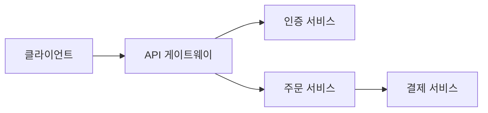

## 📋 CLAUDE.md = 매 대화마다 자동 주입되는 프로젝트 기억 장치

잘 작성된 CLAUDE.md 하나가 수십 번의 반복 설명을 대신합니다.

Claude는 대화가 시작될 때마다 CLAUDE.md를 컨텍스트 윈도우 최상단에 자동으로 주입합니다. LLM에겐 장기 기억이 없기 때문에, CLAUDE.md가 유일한 프로젝트 컨텍스트입니다.

---

## ✍️ 뭘 넣어야 할까? — 5가지 핵심 항목

```markdown
# CLAUDE.md

## ⚠️ 절대 규칙 (맨 위에 배치!)
- 프로덕션 DB 직접 쿼리 금지
- .env 파일 커밋 금지
- 패키지 매니저는 npm만 사용

## 🏗️ 아키텍처
src/
├── app/          # Next.js App Router 페이지
├── components/   # 재사용 UI 컴포넌트
└── lib/          # 유틸리티, API 클라이언트

## 🔧 빌드 & 테스트 명령어
- 개발 서버: npm run dev
- 빌드: npm run build
- 테스트: npm run test

## 💼 도메인 컨텍스트
Product → Variant → 독립 재고 구조

## 📏 코딩 컨벤션
- 컴포넌트: PascalCase
- 훅: camelCase (use 접두사)
- 커밋 메시지: feat. 한글 설명 형식
```

> 💡 절대 규칙은 반드시 맨 위에 배치하세요. Claude는 컨텍스트 앞부분에 나온 내용을 더 강하게 인식합니다.

---

## 🎯 트리거 키워드 등록

자주 쓰는 워크플로우를 키워드로 등록해두면 한 마디로 실행할 수 있습니다.

```markdown
## 트리거 키워드
- "build the app"   → npm run build 실행 후 결과 리포트
- "deploy staging"  → Vercel staging 환경에 배포
- "run tests"       → npm test 실행 후 실패한 테스트 분석
```

이제 "build the app"이라고 말하면 Claude가 자동으로 빌드를 실행하고 결과를 알려줍니다.

---

## 🤝 팀 공유 vs 개인 설정 분리

| 파일 위치 | 내용 | Git 커밋 |
|----------|------|----------|
| 프로젝트 `CLAUDE.md` | 팀 공통 규칙, 아키텍처 | ✅ 커밋 → 팀 전체 공유 |
| `~/.claude/CLAUDE.md` | 개인 API 키, 개인 선호도 | ❌ 커밋 안 함 |

팀 공통 = 프로젝트 / 개인 전용 = 글로벌로 깔끔하게 분리하는 것이 핵심입니다.

---

## 📦 Lazy Loading — 토큰 절약의 핵심

CLAUDE.md에 모든 걸 직접 써 넣으면 매 세션마다 수천 토큰이 낭비됩니다.

```markdown
# ❌ 나쁜 예 — 모든 내용을 직접 작성
## API 엔드포인트
- POST /api/auth/login
- POST /api/auth/register
- GET /api/users/:id
- ... (50개 더)
```

```markdown
# ✅ 좋은 예 — 한 줄짜리 참조만 남기기
## 프로젝트 문서
- API 스펙: @docs/api-spec.md
- DB 스키마: @docs/db-schema.md
- 인증 설계: @docs/auth.md
- 코딩 컨벤션: @docs/conventions.md
```

Claude는 필요할 때만 `@` 참조된 파일을 읽습니다. 이게 **Lazy Loading**입니다. 평소에는 가볍고, 필요할 때만 전체를 불러옵니다.

> 💡 CLAUDE.md는 되도록 **300자 이내**로 유지하는 게 효율적입니다.

---

## 📁 폴더별 CLAUDE.md

대규모 프로젝트에서는 폴더별로 CLAUDE.md를 분리할 수 있습니다.

```
src/
├── auth/
│   └── CLAUDE.md     # 인증 모듈 전용 규칙
├── payments/
│   └── CLAUDE.md     # 결제 모듈 전용 규칙
└── CLAUDE.md         # 전체 공통 규칙
```

Claude가 `src/auth/` 폴더 작업을 할 때만 `src/auth/CLAUDE.md`를 읽습니다. 컨텍스트 낭비 없이 정확한 규칙만 주입됩니다.

---

## 🗺️ Mermaid 아키텍처 다이어그램

텍스트 설명보다 다이어그램이 훨씬 빠릅니다. CLAUDE.md에 Mermaid로 시스템 구조를 넣어보세요.

```markdown
## 시스템 구조


```

> 💡 별도 파일(`docs/architecture.md`)에 정리하고 `@docs/architecture.md`로 참조하면 더 깔끔합니다.

---

## 🔄 Claude에게 업데이트 맡기기

직접 수정하지 않아도 됩니다. Claude에게 이렇게 요청하면 됩니다.

```
"방금 우리가 정한 패턴, CLAUDE.md에 추가해줘"
"오늘 결정한 DB 스키마 변경 내용 문서화해줘"
```

Claude가 기존 내용과 자연스럽게 병합해서 업데이트해줍니다.
